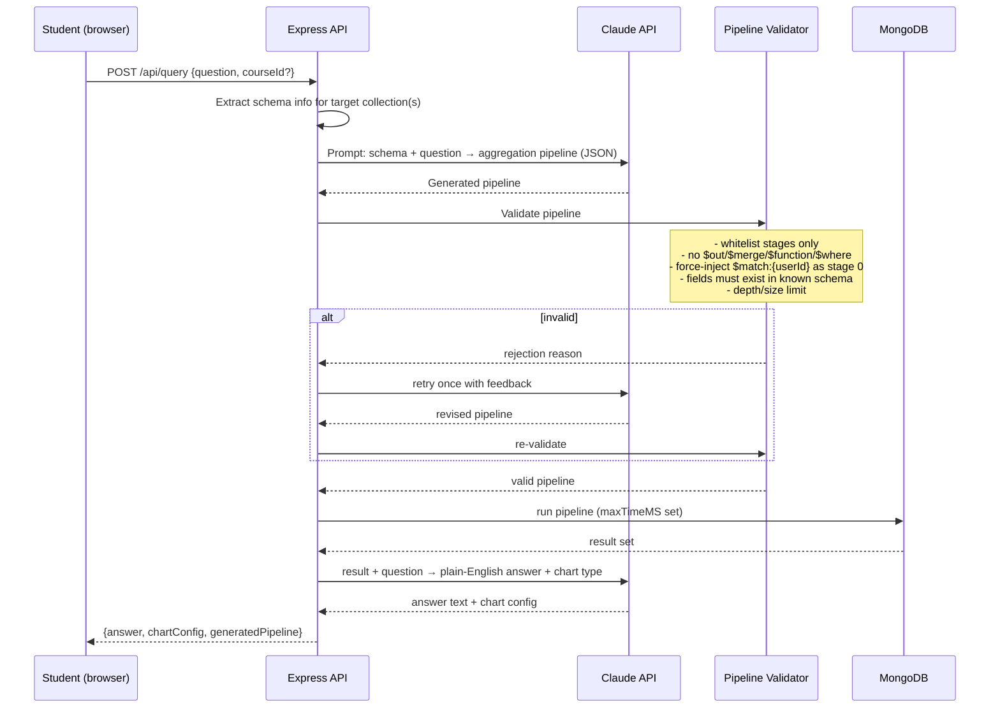

# PROJECT_PLAN.md — Semester Risk Analyzer

**Type:** Self-service AI-powered student performance & early-warning tool
**Evolved from:** Project C (AI Data Analyst Agent) — same "NL question → generated query → validated → executed" core, repointed at MongoDB and a single-student use case.

---

## 1. Problem Statement

University students track grades and attendance across a mess of sources — LMS pages, professor spreadsheets, paper syllabi with weighted grading schemes — and usually only find out they're failing a course when it's too late to fix it. There's no single place a student can log what they know throughout the semester (grades so far, attendance, missed assignments) and get an honest, quantified answer to "am I actually at risk in this class, and why?"

This is a real, personal, recurring problem (every student, every semester) — not a hypothetical business use case, which makes it a stronger portfolio story than a generic CRUD app.

## 2. Solution Overview

A self-service web app where a student:
1. Creates an account and adds their courses for the term (with each course's grading breakdown — e.g., "Midterm 30%, Final 40%, Assignments 30%").
2. Logs grade entries and attendance as the semester progresses (manual entry or CSV import).
3. Gets an automatically computed **risk score per course** (rule-based, not AI-guessed) based on current weighted grade trajectory + attendance.
4. Can **ask plain-English questions** about their own data ("Which course is dragging my GPA down?", "Do I need above 85 on the final to pass Calculus?") — answered by an LLM that generates a MongoDB aggregation pipeline, which is validated and scoped to that student's data before it ever runs.
5. Can generate a **semester report** — an LLM-written narrative summary of standing across all courses, meant to be something a student could genuinely bring to an academic advisor.

Because everything is scoped to one authenticated student's own data, this is architecturally a standard multi-tenant SaaS pattern (many independent single-user accounts) — which is exactly the "auth + data isolation" story that shows up in every real engineering interview.

## 3. Why This Project Is Resume-Worthy

**Honest assessment of the original scope (CSV → SQL → chart):** competent, but it's a text-to-SQL demo — a well-known pattern interviewers have seen many times. The validation layer was the one genuinely strong idea in it.

**What elevates this version:**

| Weak/generic if left as-is | What makes it strong |
|---|---|
| "LLM writes a query" | LLM writes a **MongoDB aggregation pipeline** — a nested JSON structure, not a string — so your validator has to reason about *structure*, not just keywords. This is a harder and less-commonly-demoed problem than text-to-SQL, so it stands out more. |
| Trusting the LLM to scope queries to the right user | **Server always force-injects `$match: {userId}}` as the mandatory first stage**, regardless of what the LLM generated — the LLM's output is never the sole guarantee of data isolation. This is a genuinely good, interview-worthy security decision, not a throwaway line. |
| Just returning query results | A **rule-based risk-scoring engine** that's independent of the LLM — deterministic, explainable, testable. Shows you know when *not* to reach for AI. |
| Static CSV upload only | Full CRUD (forms) + CSV import — proves you can build real create/update/delete flows with validation, not just a read pipeline. |
| No persistence of insight | **Report generation over time** — risk assessments are stored historically, so a student can see their trend across the semester, not just a snapshot. |
| — | Rate limiting on LLM-calling endpoints (real cost-control concern), retry-with-feedback on invalid pipelines (capped, not infinite), and a real refresh-token auth flow. |

If you only add three things to make this stand out further: (1) a small test suite for the validator itself (this is the piece an interviewer will most want to see tested), (2) a "here's a pipeline the validator correctly rejected and why" example in your README, (3) a trend chart showing risk score over time, not just current state.

## 4. Tech Stack

| Layer | Choice | Why (tradeoffs specific to this project) |
|---|---|---|
| Backend | Node.js + Express | MongoDB aggregation pipelines are native JS arrays/objects. In Node, the LLM's JSON output, your validator, and the MongoDB driver all speak the same data structure with zero serialization/marshaling — in Python you'd be converting between JSON strings and dicts at every boundary for no benefit. |
| Database | MongoDB Atlas (free tier) | Chosen per project requirement. Good fit anyway: course/grade/attendance data is naturally document-shaped and doesn't need multi-table joins: `$lookup` is rarely even needed here. |
| ODM | Mongoose | Schema validation + type coercion for the CRUD collections (courses, grades, attendance). The **query pipeline itself** is still built and validated by hand with the raw MongoDB driver — Mongoose's query builder isn't designed for dynamically validating arbitrary LLM-generated pipelines. |
| LLM | Anthropic Claude API | Used for two *separate* jobs: (a) generating aggregation pipelines from NL questions, (b) writing the narrative semester report. Keep these as two distinct prompts/functions — don't conflate them. |
| Auth | JWT (access + refresh) + bcrypt | Standard, interview-legible pattern. Access token short-lived (15 min), refresh token longer-lived and revocable server-side (see §8). |
| Frontend | React (Vite) + Tailwind CSS | Fast dev loop, and Tailwind's utility classes map cleanly onto the card-based dashboard layout in your reference image. |
| Charts | Recharts | Backend sends raw data + a chart type (bar/line/scatter/donut), frontend renders it — keeps chart logic out of the backend and makes the dashboard interactive (hover tooltips, etc.) rather than static images. |
| Deploy | Render (API) + MongoDB Atlas (DB) + Vercel (frontend) | All free-tier, matches your other projects, gives you a live demo link. |

## 5. System Architecture

```
┌─────────────┐      HTTPS/JSON      ┌──────────────────┐       ┌─────────────┐
│  React SPA  │ ───────────────────► │  Express API      │ ────► │  MongoDB    │
│  (Vercel)   │ ◄─────────────────── │  (Render)         │ ◄──── │  Atlas      │
└─────────────┘     JWT in header    └────────┬──────────┘       └─────────────┘
                                               │
                                               │ HTTPS
                                               ▼
                                     ┌───────────────────┐
                                     │  Claude API        │
                                     │  (pipeline gen +    │
                                     │   report writing)   │
                                     └───────────────────┘
```

- Frontend never talks to MongoDB or the LLM directly — everything goes through the Express API, which is the only place auth, scoping, and validation are enforced.
- Access token sent as `Authorization: Bearer <token>`; refresh token sent as an httpOnly cookie (not accessible to JS — mitigates XSS token theft).

## 6. Flow Diagram — "Ask a question" path (the core hard problem)



## 7. Database Design (MongoDB)

| Collection | Key fields | Notes |
|---|---|---|
| `users` | `_id, name, email (unique idx), passwordHash, university, program, createdAt` | — |
| `refreshTokens` | `_id, userId, tokenHash, expiresAt, revoked` | Separate collection, not embedded in `users` — lets you list/revoke individual sessions ("log out other devices") and keeps the user doc small. |
| `courses` | `_id, userId, courseName, courseCode, term, credits, gradingScheme: [{category, weight}], targetGrade, createdAt` | `gradingScheme` is embedded (small, fixed-shape, always read together with the course) — a textbook case for embedding. |
| `gradeEntries` | `_id, userId, courseId, category, title, score, maxScore, date, createdAt` | **Referenced**, not embedded in `courses`. A course can accumulate dozens of entries over a term — embedding risks unbounded array growth and the 16 MB document ceiling, and you rarely need "course + all its grades" as a single atomic read. |
| `attendanceRecords` | `_id, userId, courseId, date, status, createdAt` | Same reasoning — referenced. Unique compound index on `{userId, courseId, date}` to prevent duplicate same-day entries. |
| `riskAssessments` | `_id, userId, courseId, computedAt, riskScore, riskLevel, factors: [{name, contribution}], recommendation` | Kept as its own collection (not overwritten in-place on `courses`) specifically so a student can see risk **trend over the semester**, not just current state. |
| `queries` | `_id, userId, question, generatedPipeline, validationStatus, targetCollection, resultSummary, chartConfig, createdAt` | Audit trail of every NL question — mirrors the original project's `queries` table. `validationStatus`: `valid \| invalid_retried \| failed`. |
| `reports` | `_id, userId, term, generatedAt, content (markdown), riskSummary` | One per student per term, regeneratable. |

**Indexes:**
- `users.email` — unique
- `courses`: `{userId: 1, term: 1}`
- `gradeEntries`: `{userId: 1, courseId: 1}`, `{userId: 1, date: 1}`
- `attendanceRecords`: `{userId: 1, courseId: 1, date: 1}` — unique
- `riskAssessments`: `{userId: 1, courseId: 1, computedAt: -1}`
- `queries`: `{userId: 1, createdAt: -1}`

## 8. Authentication & Security

**JWT flow:**
1. Login → issue **access token** (15 min expiry, signed with `JWT_ACCESS_SECRET`) returned in response body, and **refresh token** (7–30 day expiry, signed with `JWT_REFRESH_SECRET`) set as an httpOnly, `secure`, `sameSite=strict` cookie. Refresh token's hash (not the raw token) is stored in `refreshTokens` so it can be revoked server-side.
2. Every protected route uses `authMiddleware` → verifies access token, attaches `req.user = {id, email}`.
3. On access-token expiry, frontend calls `POST /api/auth/refresh` → server checks the refresh token against the stored hash, issues a new access token. If the stored token is revoked or missing, force re-login.
4. Logout → revoke the matching row in `refreshTokens` and clear the cookie.

**Other security musts:**
- Passwords hashed with bcrypt, cost factor 12. Never log or return `passwordHash`.
- **All data queries scoped server-side by `req.user.id`** — the client never supplies `userId`; it's always taken from the verified JWT. This applies to every CRUD route *and* is force-injected into every LLM-generated pipeline (see §6/§9).
- Input validation on every POST/PUT body via `zod` schemas (reject unknown fields, wrong types, out-of-range scores).
- Rate limiting (`express-rate-limit`): strict on `/api/auth/login` (brute-force protection) and `/api/query` (LLM cost control — e.g., 20 requests/15min per user).
- CORS locked to the deployed frontend origin only.
- `helmet` for standard security headers.
- All secrets in `.env`, never committed; `.env.example` committed with placeholder values.
- Mongo-injection hygiene: strip any client-supplied object keys starting with `$` or containing `.` before they can reach a query (`express-mongo-sanitize`), on top of the pipeline validator itself.

## 9. API Design

| Method | Route | Auth | Purpose |
|---|---|---|---|
| POST | `/api/auth/register` | ✗ | `{name, email, password}` → creates user, returns tokens |
| POST | `/api/auth/login` | ✗ | `{email, password}` → returns access token + sets refresh cookie |
| POST | `/api/auth/refresh` | cookie | Issues new access token |
| POST | `/api/auth/logout` | ✓ | Revokes refresh token |
| GET | `/api/courses` | ✓ | List student's courses |
| POST | `/api/courses` | ✓ | Create course + grading scheme |
| PUT | `/api/courses/:id` | ✓ | Update course/grading scheme |
| DELETE | `/api/courses/:id` | ✓ | Delete course (cascades grades/attendance) |
| GET | `/api/courses/:id/grades` | ✓ | List grade entries for a course |
| POST | `/api/courses/:id/grades` | ✓ | Add a grade entry |
| PUT | `/api/grades/:id` | ✓ | Edit a grade entry |
| DELETE | `/api/grades/:id` | ✓ | Delete a grade entry |
| POST | `/api/courses/:id/grades/import` | ✓ | CSV import (multipart) |
| GET | `/api/courses/:id/attendance` | ✓ | List attendance records |
| POST | `/api/courses/:id/attendance` | ✓ | Log attendance |
| GET | `/api/risk` | ✓ | Current risk score for every course |
| GET | `/api/risk/:courseId/history` | ✓ | Risk score over time (trend chart) |
| POST | `/api/query` | ✓ | `{question, courseId?}` → NL question pipeline |
| GET | `/api/queries` | ✓ | Query history |
| POST | `/api/reports/generate` | ✓ | Generates/regenerates the semester report |
| GET | `/api/reports/:term` | ✓ | Fetch a stored report |

## 10. Frontend Structure

Matches the reference dashboard image: dark sidebar, card-based main area, top bar with search + avatar.

**Page layout:**
```
Sidebar (persistent)         Main area (routed)
├── Dashboard                ├── /dashboard  → overview cards + charts
├── Courses                  ├── /courses    → course list + add/edit
├── Grades                   ├── /courses/:id → grade + attendance entry
├── Attendance                     (tabs: Grades | Attendance)
├── Ask AI                   ├── /ask        → NL query interface + history
├── Reports                  ├── /reports    → generated report + regenerate
└── Profile                  └── /profile    → account settings
```

**Component tree (key pieces):**
```
App
├── AuthProvider (context: user, tokens, login/logout/refresh)
├── ProtectedRoute (wraps authenticated pages)
├── Layout
│   ├── Sidebar (nav items, active-route highlight)
│   └── Topbar (search, avatar/menu)
├── DashboardPage
│   ├── SemesterOverviewCard (donut: on-track / at-risk / failing)
│   ├── RiskGaugeCard (per top-risk course)
│   ├── TopCoursesCard / AtRiskCoursesCard
│   └── AttendanceVsGradeChart (scatter, Recharts)
├── CoursesPage → CourseList, CourseFormModal
├── CourseDetailPage → GradesTab, AttendanceTab, GradeFormModal, CSVImportButton
├── AskAIPage → QuestionInput, AnswerCard, ChartDisplay, QueryHistoryList
├── ReportsPage → ReportViewer, RegenerateButton
└── ProfilePage
```

**State management:** React Context for auth (small, global, infrequent updates). TanStack Query (React Query) for all server data — gives you caching, refetch-on-focus, and optimistic updates on CRUD forms essentially for free, which is worth calling out as a deliberate choice in interviews over hand-rolled `useState`/`useEffect` fetching.

**Routing:** React Router v6, with a single `ProtectedRoute` wrapper redirecting to `/login` if no valid session.

## 11. Folder Structure

```
semester-risk-analyzer/
├── backend/
│   ├── src/
│   │   ├── config/
│   │   │   └── db.js
│   │   ├── models/
│   │   │   ├── User.js
│   │   │   ├── RefreshToken.js
│   │   │   ├── Course.js
│   │   │   ├── GradeEntry.js
│   │   │   ├── AttendanceRecord.js
│   │   │   ├── RiskAssessment.js
│   │   │   ├── Query.js
│   │   │   └── Report.js
│   │   ├── middleware/
│   │   │   ├── authMiddleware.js
│   │   │   ├── errorHandler.js
│   │   │   ├── validate.js          (zod wrapper)
│   │   │   └── rateLimiters.js
│   │   ├── controllers/
│   │   │   ├── authController.js
│   │   │   ├── courseController.js
│   │   │   ├── gradeController.js
│   │   │   ├── attendanceController.js
│   │   │   ├── riskController.js
│   │   │   ├── queryController.js
│   │   │   └── reportController.js
│   │   ├── routes/
│   │   │   ├── authRoutes.js
│   │   │   ├── courseRoutes.js
│   │   │   ├── gradeRoutes.js
│   │   │   ├── attendanceRoutes.js
│   │   │   ├── riskRoutes.js
│   │   │   ├── queryRoutes.js
│   │   │   └── reportRoutes.js
│   │   ├── services/
│   │   │   ├── riskEngine.js         (rule-based scoring — no LLM)
│   │   │   ├── pipelineGenerator.js  (prompt → aggregation pipeline)
│   │   │   ├── pipelineValidator.js  (the core safety component)
│   │   │   ├── reportGenerator.js    (LLM narrative report)
│   │   │   └── csvImporter.js
│   │   ├── utils/
│   │   │   ├── jwt.js
│   │   │   └── AppError.js
│   │   └── app.js
│   ├── server.js
│   ├── tests/
│   │   ├── auth.test.js
│   │   ├── pipelineValidator.test.js
│   │   └── riskEngine.test.js
│   ├── package.json
│   └── .env.example
├── frontend/
│   ├── src/
│   │   ├── api/
│   │   │   └── client.js
│   │   ├── context/
│   │   │   └── AuthContext.jsx
│   │   ├── components/
│   │   │   ├── layout/ (Sidebar.jsx, Topbar.jsx, Layout.jsx)
│   │   │   ├── dashboard/ (SemesterOverviewCard.jsx, RiskGaugeCard.jsx, AttendanceVsGradeChart.jsx)
│   │   │   ├── courses/ (CourseList.jsx, CourseFormModal.jsx)
│   │   │   ├── grades/ (GradesTab.jsx, GradeFormModal.jsx, CSVImportButton.jsx)
│   │   │   ├── ask/ (QuestionInput.jsx, AnswerCard.jsx, ChartDisplay.jsx)
│   │   │   └── common/ (Button.jsx, Modal.jsx, Spinner.jsx)
│   │   ├── pages/
│   │   │   ├── LoginPage.jsx, RegisterPage.jsx
│   │   │   ├── DashboardPage.jsx
│   │   │   ├── CoursesPage.jsx, CourseDetailPage.jsx
│   │   │   ├── AskAIPage.jsx
│   │   │   ├── ReportsPage.jsx
│   │   │   └── ProfilePage.jsx
│   │   ├── routes/
│   │   │   └── ProtectedRoute.jsx
│   │   ├── App.jsx
│   │   └── main.jsx
│   ├── package.json
│   └── .env.example
└── README.md
```

## 12. Milestones / Build Order

| Phase | Scope | "Done" means |
|---|---|---|
| 1. Auth | register/login/refresh/logout, protected route middleware | Can register, log in, hit a protected test route, refresh a token, log out — all via Postman/Thunder Client. |
| 2. Core CRUD | Courses, grade entries, attendance — models, controllers, routes, validation; CSV import | Can create a course with a grading scheme and add grades/attendance manually and via CSV, all scoped correctly by user. |
| 3. Risk engine + Dashboard UI | Rule-based risk scoring service, dashboard cards/charts matching reference image | Dashboard shows real computed risk per course from real logged data — no AI involved yet. |
| 4. NL Query (the hard problem) | pipelineGenerator, pipelineValidator, execution, retry-once, Ask AI page | Can ask a real question, see the generated pipeline, see it get force-scoped to the user, get a correct answer + chart. Also demo at least one deliberately malicious/invalid question and show it gets rejected. |
| 5. Report generation | reportGenerator service, Reports page | Can generate a narrative semester report from real data, stored and re-fetchable. |
| 6. Polish + Deploy | Testing, README, responsive check, deploy | Full checklist in build-instructions doc passes. |

**Pause for review after each phase** — don't proceed to the next until you've confirmed the current one works end-to-end.

## 13. Deployment Plan

| Piece | Where | Notes |
|---|---|---|
| Database | MongoDB Atlas (free M0 cluster) | Whitelist Render's outbound IP or `0.0.0.0/0` for simplicity in a portfolio project (note this tradeoff in README). |
| Backend | Render (Web Service, Node) | Env vars set in Render dashboard; enable auto-deploy from GitHub main branch. |
| Frontend | Vercel | Env var for `VITE_API_URL` pointing at the Render backend URL; auto-deploy from GitHub. |
| Secrets | Both platforms' env var UI | Never in the repo. `.env.example` documents required keys with no real values. |

## 14. What Goes in the Resume/README

**Resume bullets (pick 2–3):**
- "Built a full-stack student performance tracker with a natural-language query interface that generates and validates MongoDB aggregation pipelines before execution, including forced query scoping to prevent cross-user data access."
- "Designed a rule-based risk-scoring engine (independent of the LLM) to flag at-risk courses from weighted grade and attendance data, with historical trend tracking."
- "Implemented JWT access/refresh token authentication with server-side revocation, rate limiting, and input validation across a Node/Express/MongoDB API."

**Suggested README structure:**
1. One-paragraph pitch + live demo link + screenshot/GIF
2. Problem it solves (from §1 above, condensed)
3. Architecture diagram (reuse the Mermaid diagram)
4. **"How I stop the AI from touching data it shouldn't"** — dedicated section walking through the validator + forced `$match` injection, with one real example of a rejected pipeline. This is your standout section — don't bury it.
5. Tech stack table
6. Local setup instructions
7. What's out of scope / known limitations (be honest — e.g., ambiguous NL questions, no multi-course joins)
8. Tests + how to run them
