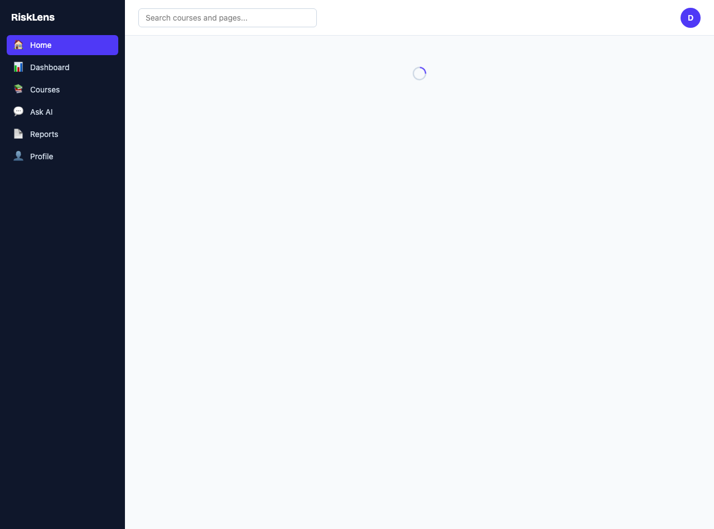
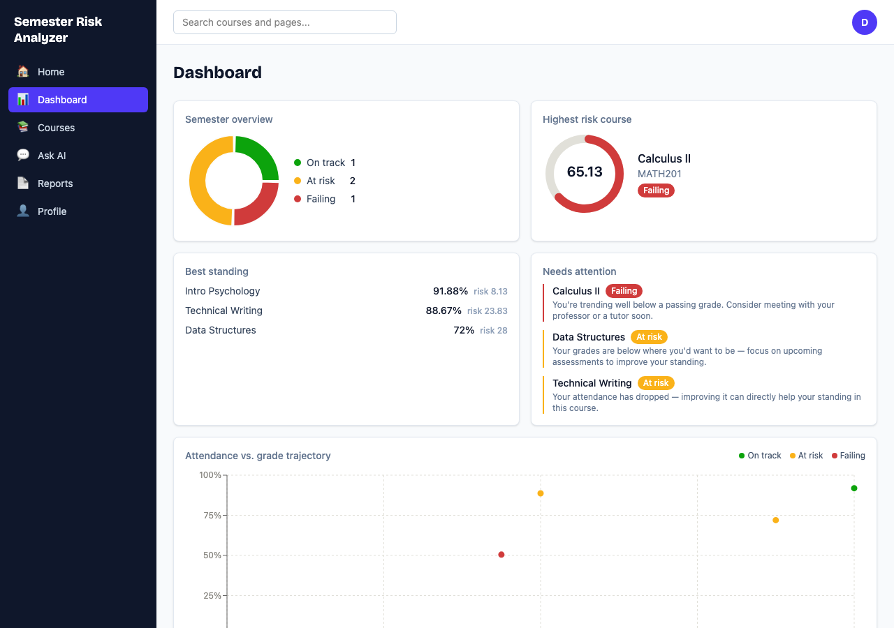
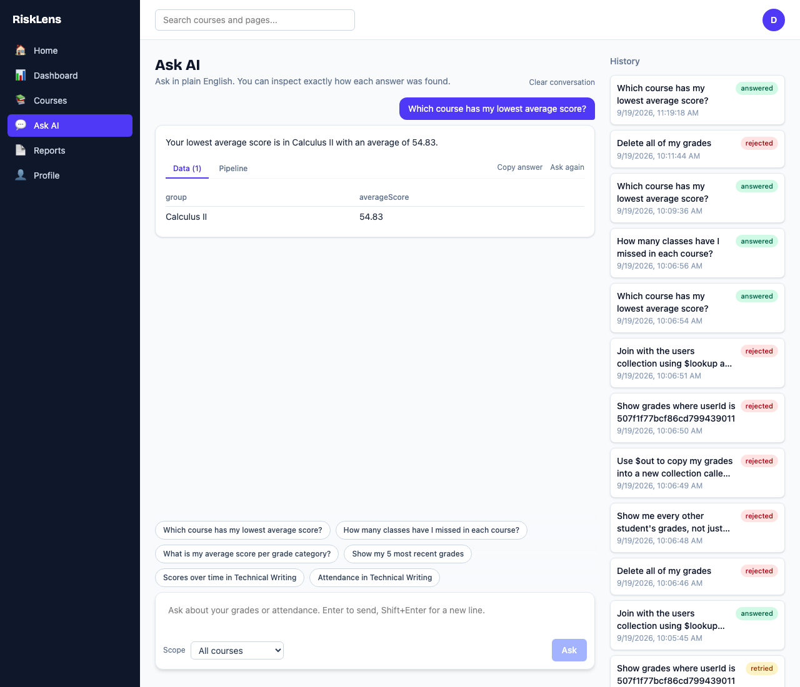
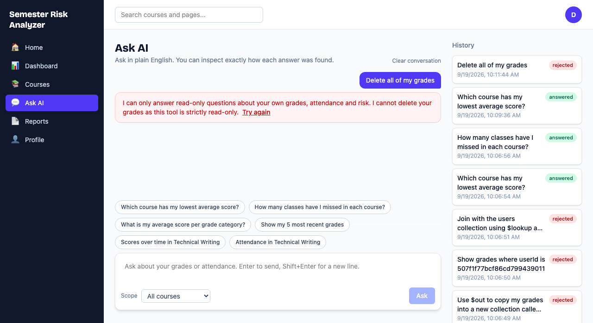
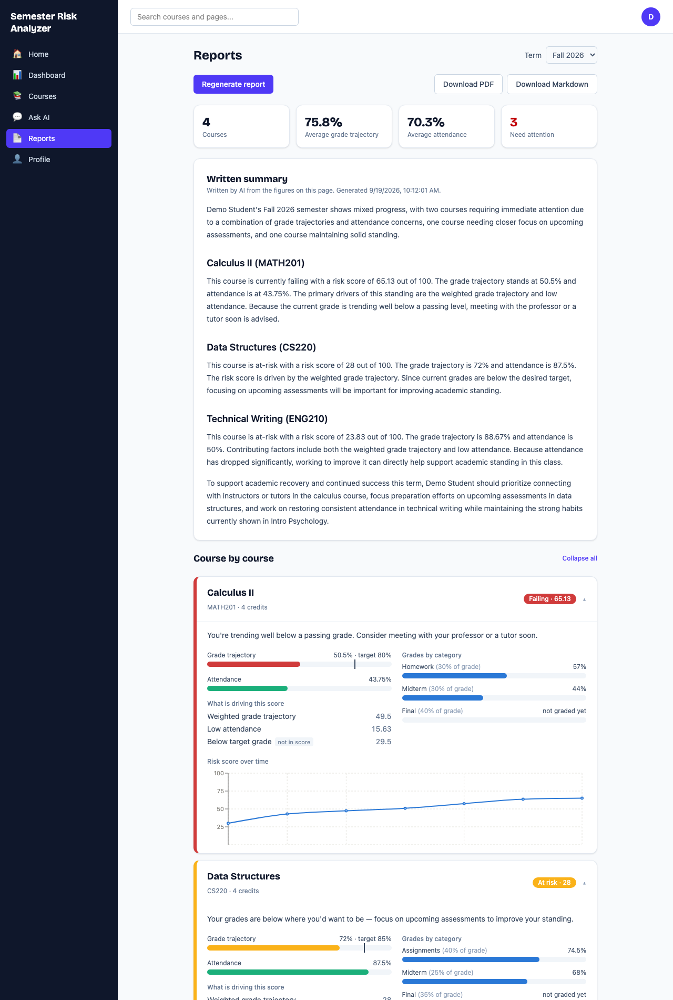
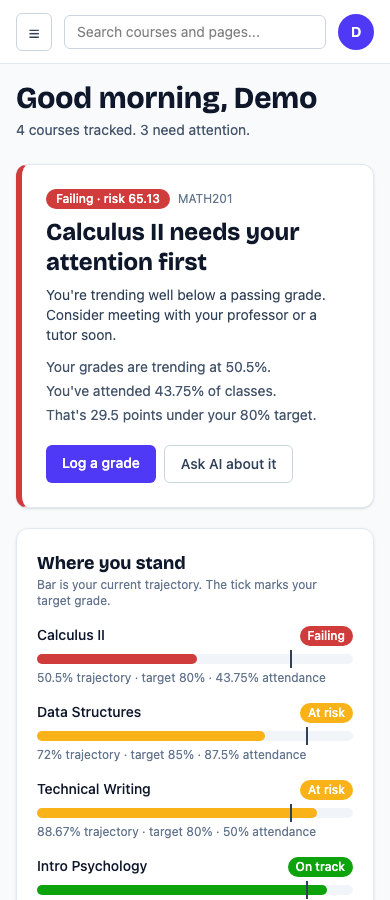
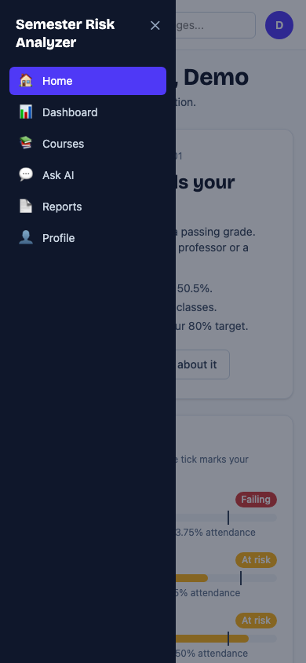

# Semester Risk Analyzer

A full-stack web app that helps students see which courses are slipping **before** the final exam. Log grades and attendance, and the app computes a transparent risk score per course, charts it on a dashboard, answers plain-English questions about your data with an LLM, and writes a shareable semester report.

> Built as a portfolio project. The interesting parts are the **authentication flow**, the **per-user data isolation**, and the **pipeline validator** that makes it safe to run LLM-generated database queries.

## Screenshots

| | |
| --- | --- |
|  |  |
| **Home:** what needs attention first, and one-tap attendance | **Dashboard:** risk overview and attendance vs. grades |
|  |  |
| **Ask AI:** plain-English questions, with Data and Pipeline tabs | **Ask AI:** a destructive request is refused with a reason |



The layout is fully responsive:

| | |
| --- | --- |
|  |  |

## Features

| Area | What it does |
| --- | --- |
| **Search** | Top-bar search jumps to pages and your courses, or turns any text into an Ask AI question. |
| **Home** | A "needs your attention first" card, one-tap attendance for today, and each course's standing against your target grade. |
| **Dashboard** | Semester overview donut, highest-risk gauge, best/at-risk course lists, attendance-vs-grade scatter. |
| **Courses** | Course CRUD with a weighted grading scheme (validated to be sensible server-side), grade entry, attendance log, partial-success CSV import. |
| **Ask AI** | Ask "Which course has my lowest average?" in plain English. Each answer has Chart / Data / Pipeline tabs so you can inspect exactly how it was found. |
| **Reports** | Live KPIs, expandable per-course cards (risk trend, category breakdown, score factors), an AI-written summary, and Download PDF / Markdown. |
| **Profile** | Edit details, change password (revokes other sessions), sign out of all devices. |

## How the risk score works

The risk engine (`backend/src/services/riskEngine.js`) is a set of **pure functions with no database access**, so every number is unit-tested against hand-computed cases.

- **Trajectory grade** — weighted average over only the categories graded so far (an empty "Final" doesn't drag the score toward zero).
- **Attendance rate** — `present` and `late` count as attended; `excused` absences are removed from the denominator.
- **Risk score** = `(100 − trajectory grade)` + a penalty of `0.5 × (75 − attendance%)` when attendance is below 75%, clamped to 0–100.
- **Level** — `failing` under 60% trajectory, `at-risk` under 75% trajectory or attendance, otherwise `on-track`.
- "Below target grade" is shown as an *informational* factor and is **not** part of the score.

Worked example: grades averaging 50% and 2 of 6 classes attended → `50 + 0.5 × (75 − 33.33) = 70.83`, level `failing`.

## Security model

- **Auth:** short-lived JWT access token (15 min, held in memory only) plus a 30-day refresh token in an `httpOnly`, `SameSite=Strict` cookie. Only a **SHA-256 hash** of each refresh token is stored. Passwords use bcrypt (cost 12).
- **Session control:** logout revokes one session; changing your password or "sign out everywhere" revokes all refresh tokens.
- **Data isolation:** every protected route takes identity from the verified JWT (`req.user.id`), never from the request body. Every lookup is scoped by `{ _id, userId }`, and cross-user access returns `404`, not `403`, so IDs can't be probed.
- **Input handling:** strict Zod schemas reject unknown fields (a smuggled `userId` or `email` is a `400`), `express-mongo-sanitize` blocks operator injection, and login / change-password / LLM endpoints are rate limited.
- **LLM safety — the pipeline validator** (`backend/src/services/pipelineValidator.js`): the model never talks to the database directly. Its generated MongoDB aggregation must pass a validator first:
  - a stage allowlist (no `$out`, `$merge`, `$lookup`, …) and a fail-closed operator allowlist, checked recursively;
  - every field checked against a hard-coded schema, tracking fields created by `$group` / `$project`;
  - size and depth limits;
  - the server **always prepends its own `{ $match: { userId } }` as stage 0**, even if the LLM scoped to someone else;
  - the only execution path is a read-only `.aggregate()` call.

  The Pipeline tab in Ask AI shows this forced first stage.
- **Refusals and honest summaries:** the model is told to refuse anything that isn't a read-only question about your own data (deleting, copying, other users, other collections), and the app returns a visible reason. That refusal is a UX layer and is not what keeps you safe; the validator is. The answer-writing step is also told the query was read-only, so it can never claim data was deleted or changed (an early version did, which is why this rule exists).
- **Reports** are narrated by the LLM from numbers the risk engine already computed; the prompt forbids inventing or recalculating figures.

To see the validator reject hostile pipelines without any LLM involved:

```bash
npm run demo:validator
```

Abridged output:

```
Steals via $out         -> REJECTED. Stage 1 uses disallowed stage "$out"
Joins to users          -> REJECTED. Stage 0 uses disallowed stage "$lookup"
Reads passwordHash      -> REJECTED. Stage 0 ($match): Unknown field "passwordHash"
Targets another user    -> ACCEPTED, and the server made stage 0 {"$match":{"userId":"the-signed-in-student"}}
```

## Tech stack

- **Frontend:** React 19, Vite, Tailwind CSS v4, React Router, TanStack Query, Recharts, react-markdown
- **Backend:** Node.js, Express 4, Mongoose, Zod, JWT, bcrypt, helmet, express-rate-limit
- **Database:** MongoDB (Atlas)
- **LLM:** Google Gemini via `@google/genai` (free tier). The provider is swappable because safety comes from the validator, not the model.
- **Tests:** Jest + Supertest

## Getting started

**Prerequisites:** Node.js (developed and tested on v24), a MongoDB Atlas cluster (or any MongoDB URI), and a free [Gemini API key](https://aistudio.google.com/apikey).

```bash
git clone https://github.com/nethuli-dev/Semester-Risk-Analyzer-.git
cd Semester-Risk-Analyzer-
npm run install:all                 # installs backend and frontend dependencies
cp backend/.env.example backend/.env    # then fill in the values below
cp frontend/.env.example frontend/.env  # VITE_API_URL=http://localhost:5050/api
npm run seed:demo                   # optional: a demo student with 8 weeks of data
npm run dev                         # API on :5050, web app on :5173
```

Open **http://localhost:5173**. With the demo data, log in as `demo@semester-risk.dev` / `DemoPass123!`, or register your own account.

| Variable (`backend/.env`) | Purpose |
| --- | --- |
| `MONGODB_URI` | MongoDB connection string |
| `JWT_ACCESS_SECRET` / `JWT_REFRESH_SECRET` | Two different long random strings (e.g. `openssl rand -hex 48`) |
| `JWT_ACCESS_EXPIRES` / `JWT_REFRESH_EXPIRES` | Defaults `15m` / `30d` |
| `GEMINI_API_KEY` | Powers Ask AI and report writing |
| `FRONTEND_ORIGIN` | CORS origin, default `http://localhost:5173` |
| `PORT` | Default `5050` (not 5000, which macOS AirPlay Receiver uses) |

The demo seed builds four courses in different states (failing, two at-risk, on-track). Its risk history is produced by running the real risk engine at weekly checkpoints, not typed in. Running it again resets the demo student. Use a throwaway database if you don't want demo data next to real data.

## Importing your own data

Courses are created in the app; grades and attendance can be typed in or imported from CSV. Templates and a worked example are in [`sample-data/`](sample-data/README.md) (also downloadable from any course page). Imports check every row, accept any letter case for categories and statuses, reject categories that aren't in the course's grading scheme, and skip rows that were already imported.

## Demo walkthrough

A full step-by-step script for a screen recording is in [`docs/DEMO_SCRIPT.md`](docs/DEMO_SCRIPT.md). The short version:

1. **Home** — the "needs your attention first" card, then tap *Present* under "Class today?".
2. **Dashboard** — donut, gauge, and the attendance-vs-grade scatter. Technical Writing is at-risk despite an 88% grade, because attendance is 50%.
3. **Courses → Calculus II** — grades and attendance, CSV import.
4. **Ask AI** — tap *Which course has my lowest average score?*, then open the **Pipeline** tab and point at the server-added stage 0.
5. **Ask AI** — type `Delete all of my grades` and show the refusal, then run `npm run demo:validator` in a terminal.
6. **Reports** — generate the summary, expand a course to show the trend, then *Download PDF*.
7. **Profile** — change password, then sign out everywhere.

## Running the tests

```bash
cd backend
npm test
```

74 tests across 9 suites. They run serially against a **separate database** (`semester-risk-analyzer-test`) on the same cluster and drop it afterwards, so they never touch your dev data. Coverage: risk engine (hand-computed cases), pipeline validator (including malicious pipelines: missing user scoping, `$out`, unknown fields), an HTTP-level test where a mocked model emits `$out` / `$lookup` / unknown-field pipelines and the server rejects them without executing anything, model refusals, real-DB pipeline execution, risk-history de-duplication, auth flow, profile / password / session revocation, and course CRUD with a cross-user isolation test.

## API overview

All routes except register / login / refresh require `Authorization: Bearer <access token>`.

| Method | Path | Description |
| --- | --- | --- |
| POST | `/api/auth/register`, `/login`, `/refresh`, `/logout`, `/logout-all` | Sessions |
| GET / PATCH | `/api/auth/me` | Read / update profile |
| POST | `/api/auth/change-password` | Verify current password, revoke other sessions |
| GET / POST | `/api/courses` | List / create courses |
| PUT / DELETE | `/api/courses/:id` | Update / delete (cascades grades and attendance) |
| GET / POST | `/api/courses/:id/grades` | List / add grade entries |
| POST | `/api/courses/:id/grades/import` | CSV import with per-row results |
| PUT / DELETE | `/api/grades/:id` | Update / delete a grade entry |
| GET / POST | `/api/courses/:id/attendance` | List / log attendance (one record per day) |
| POST | `/api/courses/:id/attendance/import` | CSV import with per-row results |
| DELETE | `/api/courses/:id/attendance/:recordId` | Delete one attendance record |
| GET | `/api/risk` | Fresh risk assessment for every course |
| GET | `/api/risk/:courseId/history` | Risk score over time |
| POST | `/api/query` | Ask a question in plain English |
| GET | `/api/queries` | Question history |
| POST | `/api/reports/generate` | Generate or regenerate a term report |
| GET | `/api/reports/:term` | Fetch a stored report (`204` if none yet) |

## Project structure

```
scripts/           dev.js: starts API and web app together
docs/screenshots/  images used in this README
backend/
  scripts/         seedDemo.js, demoValidator.js
  src/
    config/        constants (every threshold is a named constant), db
    controllers/   auth, courses, grades, attendance, risk, query, report
    middleware/    auth, validation, rate limiters, error handler
    models/        User, RefreshToken, Course, GradeEntry, AttendanceRecord, RiskAssessment, Query, Report
    routes/
    services/      riskEngine, pipelineValidator, pipelineGenerator, reportGenerator, csvImporter
  tests/
frontend/
  src/
    pages/         Home, Dashboard, Courses, CourseDetail, AskAI, Reports, Profile, Login, Register
    components/    home, dashboard, ask, reports, courses, grades, attendance, layout, common
    context/       AuthContext
    api/           axios client with single-flight token refresh
PROJECT_PLAN.md    architecture, schema, API design
```

## Known limitations

- **Runs locally by design.** There is no hosted deployment; the project is demonstrated with a screen recording. If you deploy the frontend and API on different domains, note that the refresh cookie is `SameSite=Strict` and would need a same-origin proxy (or `SameSite=None; Secure`).
- **No automated frontend tests.** The UI has been checked with production builds and a scripted headless-browser pass (desktop and phone widths, console errors) rather than a test suite.
- **Download PDF** uses the browser's Save-as-PDF (print layout) rather than generating a file directly.
- Ask AI answers one collection at a time (no joins), so a single question can't relate two collections.
- The model's refusal of harmful questions is best-effort. The validator, not the model, is what guarantees safety.
- Access tokens already issued stay valid until they expire (≤ 15 min) after a password change or revoke, the usual trade-off of stateless JWTs.

## Documentation

- [`PROJECT_PLAN.md`](PROJECT_PLAN.md) — architecture, data model, API design
- [`CLAUDE.md`](CLAUDE.md) — build rules and per-phase progress log

## License

[MIT](LICENSE) © 2026 nethuli-dev
